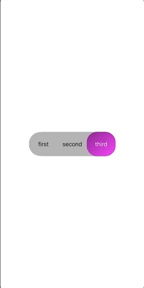

 # CustomSegmentControl

 

 # Usage

If you would like to customize control with Interace builder, create and connect referencing outlets to ```CustomSegmentControl```. Don't forget to specify file's owner for your ```.xib``` file and mention it during initialization.
Make sure your controller conforms to ```CustomSegmentControlDelegate```, for example:

```

MyViewController: UIVIewController: CustomSegmentControlDelegate {
  var control: CustomSegmentControl! 
  
  override func viewDidLoad() {
    super.viewDidLoad()
    control = CustomSegmentControl(frame: frame)
    
    control.delegate = self
 
    view.addSubview(control)
  }
  
  func customSegmentControl(_ segmentControl: CustomSegmentControl didChangeValue value: Int) {
    // Your code goes here
    // triggers when segmentControl changed value
  }
}
```

# Contribution

Feel free to play around with this control and add your customizations
